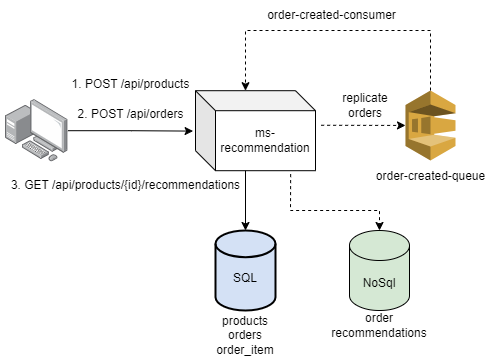

# ms-recommendation



## Arquitetura e Decisões

### Gerais
- Para fins do exercício proposto, as APIs e modelagens foram feitas todas dentro de um único projeto porém seguindo uma abordagem baseada no DDD, onde cada camada é bem isolada e responsabilizada facilitando possíveis evoluções da arquitetura. Por exemplo, caso a API de recomedação seja isolada em um serviço independente, ficará mais fácil identificar e realizar a migração dos componentes necessários para o domínio.
- Visando uma análise custosa de processamento de dados, as recomendações foram idealizadas por meio de pipeline e agregações possibilitadas por uma tecnologia NoSql. Tal escolha visa uma ferramenta própria para processamento de dados e com facilidade em uma escala horizontal se assim for necessário para um maior volume de dados.
- Para fins do exercício, a análise de recomendação é feita a cada chamada à API de recomendação. Em uma evolução da arquitetura, com alto volume de dados, o processamento poderia ser feito em períodos pré-determinados por meio de jobs e o resultado poderia ser colocado em cache por um determinado tempo. Acredito que o domínio permite uma consistência eventual, ou seja, não necessariamente os pedidos mais recentes precisariam entrar na análise. Uma estratégia poderia ser alinhada juntamente com o time de produto.
- Dado o contexto anterior, que o domínio pode permitir uma consistência eventual, ao criar um pedido no banco sql um evento async é disparado (por meio de uma fila). Tal evento é consumido por outro componente e então orquestra a replicação dos dados necessários para o banco NoSql, disponibilizando as informações para um processamento de dados.

### Stack 
- **NodeJs:** Dentre o NodeJs e o PHP minha experiência era maior com o Node no momento.
- **Banco SQL Postgres:** Para manter consistência e persistir informações relacionadas aos produtos e pedidos, foi obtado por um banco relacional
- **Banco NoSql MongoDB:** Visto que é necessário realizar uma análise mais custosa no histórico de pedidos, foi optado por uma tecnologia NoSql com MongoDB. Com ele é possível trabalhar com uma estrutura de dados semi-estruturada (ex. json) que permite trabalhar com dados complexos e aninhados. Além disso ele permite trabalhar com processamentos de dados, consultas e agregações complexas, ideal para o problem proposto.
- **Express:** Framework web escolhido devido à maior experiência pessoal com a ferramenta.
- **Typescript:** Escolhido devido à maior experiência com linguagens tipadas diminuíndo a curva de aprendizado na implementação do exercício
- **Docker:** Escolha do ambiente containerizado e padrozinado para testar localmente serviços robustos como os bancos de dados e o SQS. Tal escolha também visa maior facilidade na escalabilidade horizontal da aplicação dentre vários outros benefícios como isolamento, flexibilidade, deploy facilitado e etc. 
- **AWS SQS:** Tecnologia escolhida para processamento de eventos assíncronos devido à maior experiência pessoal.

## Instalação 
Antes de inciar instale as dependências com um dos comandos abaixo:

`yarn install` ou `npm npm install`

## Execução em ambiente local:

Utilize os comandos abaixo no terminal, a partir da raiz do projeto.

### Utilizando o makefile:
1. make start

### Utilizando os scripts do package.json
1. `docker-compose up -d`
2. `npm run build` ou `yarn run build`
3. `npm start` ou `yarn start`

## API Documentation

As requests abaixo foram exportadas em uma collection do postman que se encontra na raiz do projeto `ms-recommendation.postman_collection.json`

Ao executar localmente, por padrão, a API irá responder no host http://localhost:3000

### 1. Create Product

**Endpoint:** `POST [host]/api/products`

**Request Body:**
```json
{
    "sku": "SKU-723",
    "name": "Mochila Adidas",
    "price": 199.99
}
```

**Success Response: 201**
```json
{
    "sku": "SKU-723",
    "name": "Mochila Adidas",
    "price": 199.99,
    "id": 1
}
```
Obs.: Para fins do exercício o ID do produto é um numérico sequencial para facilitar a manipulação e teste entre requests.

### 2. Create Order

**Endpoint:** `POST [host]/api/orders`

**Request Body:**
```json
{
    "items": [
        {
            "productId": 1,
            "quantity": 1
        },
        {
            "productId": 2,
            "quantity": 1
        },
        {
            "productId": 3,
            "quantity": 2
        }
    ]
}
```
- Aqui foi optado por trabalhar apenas com os IDs dos produtos
- O ID do item é gerado internamente
- O valor unitário é buscado internamente no banco de acordo com os IDs informados
- O total do pedido é calculado internamente de acordo com o valor do produto e a quantidade adicionada ao pedido
- Os IDs informados são validados, ou seja, só é possível criar um pedido com um produto válido (que existe na base previamente)

**Success Response: 201**
```json
{
    "message": "Order created successfully"
}
```
- Para fins do exercício, como o response não é utilizado, só foi retornado um status e uma mensagem de sucesso
- Uma possível melhoria é padronizar o response da API retornando o objeto detalhado com o ID gerado internamente

### 3. Get Product Recommendations

**Endpoint:** `GET [host]/api/products/{product_id}/recommendations`

`product_id`: ID do produto que deseja analisar as recomendações relacionadas

**Required Query Parameters:**
- `startDate`: Data incial referente ao período do histórico analisado (ex. `2024-01-01`)
- `endDate`: Data final referente ao período do histórico analisado (ex. `2024-01-31`)

**Response Body:**
```json
{
    "startDate": "2024-01-01",
    "endDate": "2024-06-30",
    "recommendations": [
        {
            "productId": "2",
            "score": 0.7
        },
        {
            "productId": "3",
            "score": 0.3
        }
    ],
    "id": "1"
}
```
- Aqui foi optado por retornar apenas os IDs dos produtos recomendados, imaginando que se for necessãrio buscar detalhes do produto poderá ser utilizada a API especializada nisso (ex. `/api/products/{product_id}`)

## Execução de testes:
Comandos possíveis:

### Utilizando o makefile:
1. `make unit-test`: Execução dos testes unitários
2. `make integ-test`: Execução dos testes integrados
3. `make test`: Executa testes unitários e integrados

### Utilizando os scripts do package.json
- `npm run test:unit` ou `yarn run test:unit`: Execução dos testes unitários
- `npm run test:integration` ou `yarn run test:integration`: Execução dos testes integrados
- `npm run test` ou `yarn run test`: Executa testes unitários e integrados
